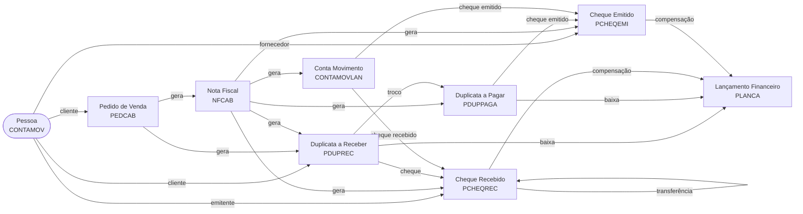

# Rastreabilidade de Documentos — Viasoft

## Visão Geral (Diagrama)

---

## PEDCAB — Pedido de Venda

### Chave Primária
- ESTAB + SERIE + NUMERO

### Upstream (quem origina)
- **Pessoa** via `CONTAMOV.NUMEROCM = PEDCAB.PESSOA`

### Downstream (o que gera)
- **NFCAB** — Nota Fiscal emitida a partir do pedido
- **PDUPREC** — Duplicata a Receber gerada na faturamento

### Tabelas de junção
- Nenhuma — vínculo direto por chave

---

## NFCAB — Nota Fiscal

### Chave Primária
- ESTAB + SEQNOTA

### Campos exibidos
- NOTA, SERIE, DTEMISSAO, VALOR

### Upstream
- **PEDCAB** via `NFCAB.ESTAB + NFCAB.PEDIDO` → `PEDCAB.ESTAB + PEDCAB.NUMERO`

### Downstream
- **PDUPREC** via `NFCABAGRFIN.SEQPAGAMENTO` → `AGRFINDUP.SEQPAGAMENTO`
- **PDUPPAGA** via `NFCABAGRFIN.SEQPAGAMENTO` → `AGRFINDUPPAG.SEQPAGAMENTO`
- **PCHEQREC** via `NFCABAGRFIN.SEQPAGAMENTO` → `AGRFINCHEREC.SEQPAGAMENTO`
- **PCHEQEMI** via `NFCABAGRFIN.SEQPAGAMENTO` → `AGRFINCHEEMI.SEQPAGAMENTO`
- **CONTAMOVLAN** via `NFCABAGRFIN.SEQPAGAMENTO` → `AGRFINCTAMOV.SEQPAGAMENTO`

### Tabelas de junção (financeiro)
- `NFCABAGRFIN` — hub central de acerto financeiro da NF (SEQPAGAMENTO)
- `AGRFINDUP` — liga NF → PDUPREC
- `AGRFINDUPPAG` — liga NF → PDUPPAGA
- `AGRFINCHEREC` — liga NF → PCHEQREC
- `AGRFINCHEEMI` — liga NF → PCHEQEMI
- `AGRFINCTAMOV` — liga NF → CONTAMOVLAN

---

## PDUPREC — Duplicata a Receber

### Chave Primária
- EMPRESA + DUPREC (ex: `359511-1`)

### Campos exibidos
- DUPREC, VALOR, DTEMISSAO, DTVENCTO, QUITADA, CLIENTE, HISTORICO

### Upstream
- **Pessoa** via `CONTAMOV.NUMEROCM = PDUPREC.CLIENTE`
- **PEDCAB** via `PDUPREC.PEDIDO + SERIE + ESTABFATURAMENTO`
- **NFCAB** via `AGRFINDUP → NFCABAGRFIN`

### Downstream
- **PLANCA** — lançamento de baixa/pagamento (`DTLANCA + SEQLANCA`)
- **PCHEQREC** — cheque recebido na baixa via `PRDURECH`
- **CONTAMOVLAN** — lançamento em conta movimento via `CONTAMOVCHRE`
- **PDUPPAGA** — troco gerado via `PRDUPTROCO`

### Tabelas de junção
- `PRDURECH` — liga PDUPREC → PCHEQREC (EMPRESA + BANCO + NROCHEQUE)
- `CONTAMOVCHRE` — liga PDUPREC → CONTAMOVLAN (NUMEROCM + ESTAB + SEQCM)
- `PRDUPTROCO` — liga PDUPREC → PDUPPAGA (troco em cheque emitido)

---

## PDUPPAGA — Duplicata a Pagar

### Chave Primária
- EMPRESA + ESTABFORNECEDOR + FORNECEDOR + DUPPAG

### Campos exibidos
- DUPPAG, VALOR, DTEMISSAO, DTVENCTO, QUITADA, FORNECEDOR, HISTORICO

### Upstream
- **Pessoa** (fornecedor) via `CONTAMOV.NUMEROCM = PDUPPAGA.FORNECEDOR`
- **NFCAB** via `AGRFINDUPPAG → NFCABAGRFIN`

### Downstream
- **PLANCA** — lançamento de pagamento (`DTLANCA + SEQLANCA`)
- **PCHEQEMI** — cheque emitido para pagamento via `PPADUCHE`

### Tabelas de junção
- `PPADUCHE` — liga PDUPPAGA → PCHEQEMI (EMPRESA + ESTABFORNECEDOR + FORNECEDOR + DUPPAG)

---

## CONTAMOVLAN — Conta Movimento (Lançamento)

### Chave Primária
- NUMEROCM + ESTAB + SEQCM

### Campos exibidos
- NUMEROCM, SEQCM, TIPO, VALOR, DTMOVTO, HISTORICO, SITUACAO

### Upstream
- **NFCAB** via `AGRFINCTAMOV → NFCABAGRFIN`

### Downstream
- **PCHEQREC** — cheque recebido gerado na baixa via `CONTAMOVCHRE`
- **PCHEQEMI** — cheque emitido gerado na baixa via `CONTAMOVCHEM`
- **PLANCA** (adiantamento) — quando `CONTAMOVTP.GERARLANFIN = 'S'`

### Tabelas de junção
- `CONTAMOVCHRE` — liga CONTAMOVLAN → PCHEQREC (NUMEROCM + ESTAB + SEQCM)
- `CONTAMOVCHEM` — liga CONTAMOVLAN → PCHEQEMI (NUMEROCM + ESTAB + SEQCM)
- `CONTAMOVLANAC` — lançamentos de acerto da conta movimento

---

## PCHEQREC — Cheque Recebido

### Chave Primária
- EMPRESA + BANCO + ESTABCLIENTE + CLIENTE + EMITENTE + NROCHEQUE

### Campos exibidos
- NROCHEQUE, BANCO, EMITENTE, DTEMISSAO, VALOR, PORTADOR, DTBOMPARA

### Upstream (quem originou o cheque)
- **Pessoa** via `CONTAMOV.NUMEROCM = CLIENTE`
- **PDUPREC** via `PRDURECH.EMPRESA + BANCO + NROCHEQUE`
- **PDUPPAGA** (troco) via `PPADUCHR`
- **CONTAMOVLAN** via `CONTAMOVCHRE.NUMEROCM + ESTAB + SEQCM`
- **NFCAB** via `AGRFINCHEREC.SEQPAGAMENTO = NFCABAGRFIN.SEQPAGAMENTO`

### Downstream (o que o cheque gera)
- **PLANCA** — compensação bancária (`DTLANCA + SEQLANCA`)
- **PLANCA** — saída por transferência (`DTLANCATRAN + SEQLANCATRAN`)
- **PLANCA** — estorno de depósito (`DTESTORNODEP + SEQESTORNODEP`)
- **PCHEQREC** — cheque no estab. destino via `TRANSFCHE` (recursivo)

### Tabelas de junção
- `PRDURECH` — PDUPREC → PCHEQREC
- `PPADUCHR` — PDUPPAGA → PCHEQREC (troco)
- `CONTAMOVCHRE` — CONTAMOVLAN → PCHEQREC
- `AGRFINCHEREC` — NFCAB → PCHEQREC (via NFCABAGRFIN)
- `TRANSFCHE` — PCHEQREC origem ↔ PCHEQREC destino (transferência entre estabs)
  - Origem: ESTAB + BANCO + ESTABCLIENTE + CLIENTE + EMITENTE + NROCHEQUE
  - Destino: ESTAB_TRAN + BANCO_TRAN + ... + EMITENTE_TRAN (com sufixo `:T`)
  - O EMITENTE do cheque destino recebe `:T` ao final

### Observações
- Cheque transferido: o destino tem `EMITENTE` terminando em `:T`
- O nó destino exibe badge "Cheque transferido — Originado do Estab. X em DD/MM/AAAA"

---

## PCHEQEMI — Cheque Emitido

### Chave Primária
- EMPRESA + PORTADOR + NROCHEQUE + SERIE

### Campos exibidos
- NROCHEQUE, SERIE, PORTADOR, FAVORECIDO, DTEMISSAO, VALOR, DTBOMPARA, HISTORICO

### Upstream (quem originou o cheque)
- **Pessoa** (fornecedor) via `CONTAMOV.NUMEROCM = FORNECEDOR`
- **PDUPPAGA** via `PPADUCHE.ESTABBAIXA + PORTADOR + NROCHEQUE + SERIE`
- **CONTAMOVLAN** via `CONTAMOVCHEM.ESTAB + PORTADOR + NROCHEQUE + SERIE`
- **NFCAB** via `AGRFINCHEEMI.SEQPAGAMENTO = NFCABAGRFIN.SEQPAGAMENTO`

### Downstream (o que o cheque gera)
- **PLANCA** — compensação bancária (`DTLANCA + SEQLANCA`)
- **PLANCA** — transferência de portador (`DTLANCATRANSF + SEQLANCATRANSF`)

### Tabelas de junção
- `PPADUCHE` — PDUPPAGA → PCHEQEMI
- `CONTAMOVCHEM` — CONTAMOVLAN → PCHEQEMI
- `AGRFINCHEEMI` — NFCAB → PCHEQEMI (via NFCABAGRFIN)
- `TRANSFPORT` — transferência de portador (PORTADOR_DE → PORTADOR_PARA)

---

## PLANCA — Lançamento Financeiro

### Chave Primária
- EMPRESA + DTLANCA + SEQLANCA

### Campos exibidos
- Empresa (código + descrição), Analítica, Data, Histórico, Portador, Valor, Usuário

### Quem gera PLANCA
- Baixa de **PDUPREC**
- Baixa de **PDUPPAGA**
- Compensação de **PCHEQREC**
- Compensação de **PCHEQEMI**
- Movimentação de **CONTAMOVLAN** (adiantamento)

### Tabelas auxiliares
- `PANALITI` — descrição da analítica (`ESTABANALITICA + ANALITICA`)
- `PPORTADO` — descrição do portador (`EMPRESA + PORTADOR`)
- `EMPRESA` — descrição da empresa (`EMPRESA.REDUZIDO`)

---

## Pessoa — Cadastro Geral

### Identificação
- `NUMEROCM` na tabela `CONTAMOV` (mesma chave usada em todos os documentos)

### Campos exibidos
- Nome, CPF/CNPJ, Endereço, Cidade/UF

### Aparece como cliente em
- PEDCAB, PDUPREC, PCHEQREC

### Aparece como fornecedor em
- PDUPPAGA (via `FORNECEDOR = NUMEROCM`)
- PCHEQEMI (via `FORNECEDOR = NUMEROCM`)

---

## Tabelas Auxiliares / Lookup

| Tabela | Uso |
|---|---|
| `PPORTADO` | Descrição do portador (banco/cofre) |
| `PANALITI` | Descrição da analítica contábil |
| `EMPRESA` | Código e nome reduzido da empresa |
| `CONTAMOVTP` | Tipo de lançamento da conta movimento |
| `PSITUACA` | Situação de documentos |
| `RECIBO` | Dados do recibo vinculado a cheques |
| `PCOBBANCO` | Cadastro de bancos (BANCO + ISPB) |
