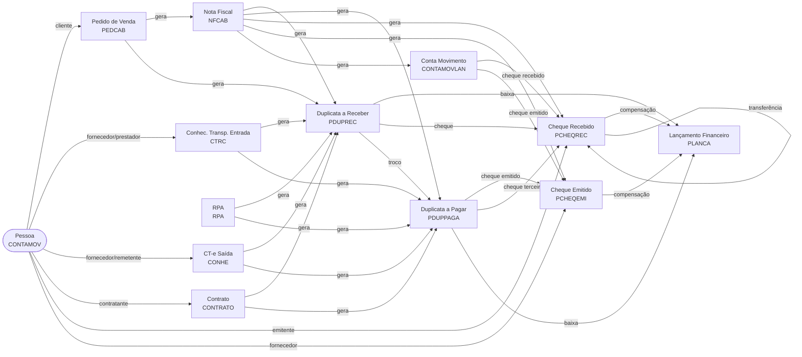

# Rastreabilidade de Documentos — Viasoft

## Visão Geral (Diagrama)



---

## Documentos de Origem de Transporte / Serviço

Estes documentos **não são pesquisáveis diretamente** na ferramenta, mas aparecem
automaticamente como nós upstream ao rastrear uma PDUPREC ou PDUPPAGA gerada a partir deles.
A cadeia exibida é sempre: **Pessoa → Doc. Origem → Duplicata**.

---

## CTRC — Conhecimento de Transporte Rodoviário de Cargas (Entrada)

### Chave Primária
- SEQCTRC (sequencial automático)

### Campos exibidos no grafo
- Nº CT-e (NROCTRC), Série, Emissão, Valor Total
- Prestador (PRESTADOR → nome via CONTAMOV)
- Fornecedor (FORNECEDOR → nome via CONTAMOV)
- CFOP, Data Entrada (DTENTRADA), Exec. Serviço (DTEXECSERV)
- Chave de Acesso (CHAVEACESSO), Origem (CIDORIGEM), Destino (CIDDESTINO), Usuário

### Upstream
- **Pessoa** (prestador) via `CONTAMOV.NUMEROCM = CTRC.PRESTADOR`
- **Pessoa** (fornecedor) via `CONTAMOV.NUMEROCM = CTRC.FORNECEDOR`

### Downstream (via AGRFIN)
- **PDUPREC** via `AGRFINCTRC.SEQPAGAMENTO` → `AGRFINDUPREC.SEQPAGAMENTO`
- **PDUPPAGA** via `AGRFINCTRC.SEQPAGAMENTO` → `AGRFINDUPPAG.SEQPAGAMENTO`

### Tabelas de junção
- `AGRFINCTRC` — liga CTRC → documentos financeiros (SEQPAGAMENTO)

---

## CONHE — Conhecimento de Transporte de Saída (CT-e)

### Chave Primária
- ESTAB + SEQCONHE

### Campos exibidos no grafo
- Nº CT-e (NUMERO), Série, Emissão, Valor Frete (TOTALFRETE)
- Prestador/Remetente (REMETENTE → nome via CONTAMOV)
- Fornecedor (FORNECEDOR → nome via CONTAMOV)
- CFOP, Data Entrada (DTENTRADASAIDA), Exec. Serviço (DTEXECSERV)
- Chave de Acesso (CHAVEACESSO), Origem (CIDADEORIGEM), Destino (CIDADEDESTINO), Usuário

### Upstream
- **Pessoa** (remetente) via `CONTAMOV.NUMEROCM = CONHE.REMETENTE`
- **Pessoa** (fornecedor) via `CONTAMOV.NUMEROCM = CONHE.FORNECEDOR`

### Downstream (via AGRFIN)
- **PDUPREC** via `CONHEAGRFIN.SEQPAGAMENTO` → `AGRFINDUPREC.SEQPAGAMENTO`
- **PDUPPAGA** via `CONHEAGRFIN.SEQPAGAMENTO` → `AGRFINDUPPAG.SEQPAGAMENTO`

### Tabelas de junção
- `CONHEAGRFIN` — liga CONHE → documentos financeiros (SEQPAGAMENTO)

---

## CONTRATO — Contrato

### Chave Primária
- ESTAB + CONTRATO

### Campos exibidos no grafo
- Nº Contrato, Emissão, Vencimento, Valor

### Upstream
- **Pessoa** (contratante) via `CONTAMOV.NUMEROCM = CONTRATO.NUMEROCM`

### Downstream (via AGRFIN)
- **PDUPREC** via `CONTRATOAGRFIN.SEQPAGAMENTO` → `AGRFINDUPREC.SEQPAGAMENTO`
- **PDUPPAGA** via `CONTRATOAGRFIN.SEQPAGAMENTO` → `AGRFINDUPPAG.SEQPAGAMENTO`

### Tabelas de junção
- `CONTRATOAGRFIN` — liga CONTRATO → documentos financeiros (SEQPAGAMENTO)

---

## RPA — Recibo de Pagamento de Autônomo

### Chave Primária
- ESTAB + CODIGO

### Campos exibidos no grafo
- Código, Período (MÊS/ANO), Valor, Descrição

### Downstream (via AGRFIN)
- **PDUPREC** via `RPAAGRFIN.SEQPAGAMENTO` → `AGRFINDUPREC.SEQPAGAMENTO`
- **PDUPPAGA** via `RPAAGRFIN.SEQPAGAMENTO` → `AGRFINDUPPAG.SEQPAGAMENTO`

### Tabelas de junção
- `RPAAGRFIN` — liga RPA → documentos financeiros (SEQPAGAMENTO)

---

## PEDCAB — Pedido de Venda

### Chave Primária
- ESTAB + SERIE + NUMERO

### Upstream
- **Pessoa** (cliente) via `CONTAMOV.NUMEROCM = PEDCAB.PESSOA`

### Downstream
- **NFCAB** — Nota Fiscal emitida a partir do pedido
- **PDUPREC** — Duplicata a Receber gerada no faturamento

### Tabelas de junção
- Nenhuma — vínculo direto por chave

---

## NFCAB — Nota Fiscal

### Chave Primária
- ESTAB + SEQNOTA

### Campos exibidos
- NOTA, SERIE, DTEMISSAO, VALOR, itens da NF (via NFITEM + ITEMAGRO)

### Upstream
- **PEDCAB** via `PEDITEMNFITEM.ESTABNOTA + SEQNOTA` → `PEDCAB.ESTAB + NUMERO`

### Downstream
- **PDUPREC** via `NFCABAGRFIN.SEQPAGAMENTO` → `AGRFINDUPREC.SEQPAGAMENTO`
- **PDUPPAGA** via `NFCABAGRFIN.SEQPAGAMENTO` → `AGRFINDUPPAG.SEQPAGAMENTO`
- **PCHEQREC** via `NFCABAGRFIN.SEQPAGAMENTO` → `AGRFINCHEREC.SEQPAGAMENTO`
- **PCHEQEMI** via `NFCABAGRFIN.SEQPAGAMENTO` → `AGRFINCHEEMI.SEQPAGAMENTO`
- **CONTAMOVLAN** via `NFCABAGRFIN.SEQPAGAMENTO` → `AGRFINCTAMOV.SEQPAGAMENTO`

### Tabelas de junção (financeiro)
- `NFCABAGRFIN` — hub central de acerto financeiro da NF (SEQPAGAMENTO)
- `AGRFINDUPREC` — liga NF → PDUPREC
- `AGRFINDUPPAG` — liga NF → PDUPPAGA
- `AGRFINCHEREC` — liga NF → PCHEQREC
- `AGRFINCHEEMI` — liga NF → PCHEQEMI
- `AGRFINCTAMOV` — liga NF → CONTAMOVLAN

---

## PDUPREC — Duplicata a Receber

### Chave Primária
- EMPRESA + DUPREC (ex: `359511-1`)

### Campos exibidos
- DUPREC, VALOR, DTEMISSAO, DTVENCTO, QUITADA, CLIENTE, HISTORICO

### Upstream (ordem de prioridade no grafo)
1. **PEDCAB** — Pessoa aponta para o Pedido quando presente
2. **NFCAB** via `AGRFINDUPREC → NFCABAGRFIN`
3. **CTRC** via `AGRFINDUPREC → AGRFINCTRC`
4. **CONHE** via `AGRFINDUPREC → CONHEAGRFIN`
5. **CONTRATO** via `AGRFINDUPREC → CONTRATOAGRFIN`
6. **RPA** via `AGRFINDUPREC → RPAAGRFIN`
- **Pessoa** (cliente) — conecta ao primeiro upstream disponível na ordem acima; caso nenhum exista, conecta diretamente à duplicata

### Downstream
- **PLANCA** — lançamento de baixa/pagamento (`PRDUPREC.DTLANCA + SEQLANCA`)
- **PCHEQREC** — cheque recebido na baixa via `PRDURECH`
- **CONTAMOVLAN** — lançamento em conta movimento via `PRDURECM`
- **PDUPPAGA** — troco gerado via `PRDUPTROCO`
- **PRVDACAR** — venda em cartão via `PACECARTAO → AGRFINCARTAO`

### Tabelas de junção
- `PRDUPREC` — baixas da duplicata a receber (SEQRECBTO)
- `PRDURECH` — PDUPREC → PCHEQREC (via BANCO + NROCHEQUE)
- `PRDURECM` — PDUPREC → CONTAMOVLAN (via NUMEROCM + SEQCM)
- `PRDUPRED` — PDUPREC → PLANCA (dinheiro/PIX/TED)
- `PRDURECAR` — PDUPREC → cartão de crédito
- `PRDUPTROCO` — troco em duplicata a pagar
- `AGRFINDUPREC` — hub AGRFIN desta duplicata (SEQPAGAMENTO)

---

## PDUPPAGA — Duplicata a Pagar

### Chave Primária
- EMPRESA + ESTABFORNECEDOR + FORNECEDOR + DUPPAG

### Campos exibidos
- DUPPAG, VALOR, DTEMISSAO, DTVENCTO, QUITADA, FORNECEDOR, HISTORICO

### Upstream (ordem de prioridade no grafo)
1. **NFCAB** via `AGRFINDUPPAG → NFCABAGRFIN` — Pessoa aponta para a NF
2. **CTRC** via `AGRFINDUPPAG → AGRFINCTRC`
3. **CONHE** via `AGRFINDUPPAG → CONHEAGRFIN`
4. **CONTRATO** via `AGRFINDUPPAG → CONTRATOAGRFIN`
5. **RPA** via `AGRFINDUPPAG → RPAAGRFIN`
- **Pessoa** (fornecedor) — conecta ao primeiro upstream disponível; caso nenhum exista, conecta diretamente à duplicata

### Downstream
- **PLANCA** — lançamento de pagamento (`PPDUPPAG.DTLANCA + SEQLANCA`)
- **PCHEQEMI** — cheque emitido via `PPADUCHE`
- **PCHEQREC** — cheque de terceiro via `PPADUCHR`
- **CONTAMOVLAN** — conta movimento via `PPADUCM`
- **PDUPPAGA** — duplicata agrupadora via `PPDUPPADUP`

### Tabelas de junção
- `PPDUPPAG` — baixas da duplicata a pagar (SEQPAGTODU)
- `PPADUCHE` — PDUPPAGA → PCHEQEMI
- `PPADUCHR` — PDUPPAGA → PCHEQREC (cheque de terceiro)
- `PPADUCM` — PDUPPAGA → CONTAMOVLAN
- `PPDUPTROCO` — troco em cheque recebido
- `PPDUPPADUP` — duplicata agrupadora
- `AGRFINDUPPAG` — hub AGRFIN desta duplicata (SEQPAGAMENTO)

---

## CONTAMOVLAN — Conta Movimento (Lançamento)

### Chave Primária
- NUMEROCM + ESTAB + SEQCM

### Campos exibidos
- NUMEROCM, SEQCM, TIPO, VALOR, DTMOVTO, HISTORICO, SITUACAO

### Upstream
- **NFCAB** via `AGRFINCTAMOV → NFCABAGRFIN`

### Downstream
- **PCHEQREC** — cheque recebido via `CONTAMOVCHRE`
- **PCHEQEMI** — cheque emitido via `CONTAMOVCHEM`
- **PLANCA** (adiantamento) — quando `CONTAMOVTP.GERARLANFIN = 'S'`

### Tabelas de junção
- `CONTAMOVCHRE` — CONTAMOVLAN → PCHEQREC (NUMEROCM + ESTAB + SEQCM)
- `CONTAMOVCHEM` — CONTAMOVLAN → PCHEQEMI (NUMEROCM + ESTAB + SEQCM)
- `CONTAMOVLANAC` — lançamentos de acerto da conta movimento
- `CONTAMOVDIN` — adiantamentos em dinheiro/PIX → PLANCA

---

## PCHEQREC — Cheque Recebido

### Chave Primária
- EMPRESA + BANCO + ESTABCLIENTE + CLIENTE + EMITENTE + NROCHEQUE

### Campos exibidos
- NROCHEQUE, BANCO, EMITENTE, DTEMISSAO, VALOR, PORTADOR (descrição), DTBOMPARA, HISTORICO, Recibo

### Upstream (quem originou o cheque)
- **Pessoa** via `CONTAMOV.NUMEROCM = CLIENTE`
- **PDUPREC** via `PRDURECH.EMPRESA + BANCO + NROCHEQUE`
- **PDUPPAGA** (troco) via `PPADUCHR`
- **CONTAMOVLAN** via `CONTAMOVCHRE.NUMEROCM + ESTAB + SEQCM`
- **NFCAB** via `AGRFINCHEREC.SEQPAGAMENTO = NFCABAGRFIN.SEQPAGAMENTO`

### Downstream (o que o cheque gera)
- **PLANCA** — compensação bancária (`DTLANCA + SEQLANCA`)
- **PLANCA** — saída por transferência (`DTLANCATRAN + SEQLANCATRAN`)
- **PLANCA** — estorno de depósito (`DTESTORNODEP + SEQESTORNODEP`)
- **PCHEQREC** — cheque no estab. destino via `TRANSFCHE` (recursivo)

### Tabelas de junção
- `PRDURECH` — PDUPREC → PCHEQREC
- `PPADUCHR` — PDUPPAGA → PCHEQREC (troco)
- `CONTAMOVCHRE` — CONTAMOVLAN → PCHEQREC
- `AGRFINCHEREC` — NFCAB → PCHEQREC (via NFCABAGRFIN)
- `TRANSFCHE` — PCHEQREC origem ↔ PCHEQREC destino (transferência entre estabs)
  - Origem: ESTAB + BANCO + ESTABCLIENTE + CLIENTE + EMITENTE + NROCHEQUE
  - Destino: ESTAB_TRAN + BANCO_TRAN + ... + EMITENTE_TRAN (com sufixo `:T`)

### Observações
- Cheque transferido: o destino tem `EMITENTE` terminando em `:T`
- O nó destino exibe badge "Cheque transferido — Originado do Estab. X em DD/MM/AAAA"
- Detalhamento completo em qualquer contexto: todos os campos disponíveis independente de ser nó raiz ou sub-nó

---

## PCHEQEMI — Cheque Emitido

### Chave Primária
- EMPRESA + PORTADOR + NROCHEQUE + SERIE

### Campos exibidos
- NROCHEQUE, SERIE, PORTADOR (descrição), FAVORECIDO, DTEMISSAO, VALOR, DTBOMPARA, HISTORICO, HISTORICO2, Recibo

### Upstream (quem originou o cheque)
- **Pessoa** (fornecedor) via `CONTAMOV.NUMEROCM = FORNECEDOR`
- **PDUPPAGA** via `PPADUCHE.ESTABBAIXA + PORTADOR + NROCHEQUE + SERIE`
- **CONTAMOVLAN** via `CONTAMOVCHEM.ESTAB + PORTADOR + NROCHEQUE + SERIE`
- **NFCAB** via `AGRFINCHEEMI.SEQPAGAMENTO = NFCABAGRFIN.SEQPAGAMENTO`

### Downstream (o que o cheque gera)
- **PLANCA** — compensação bancária (`DTLANCA + SEQLANCA`)
- **PLANCA** — transferência de portador (`DTLANCATRANSF + SEQLANCATRANSF`)

### Tabelas de junção
- `PPADUCHE` — PDUPPAGA → PCHEQEMI
- `CONTAMOVCHEM` — CONTAMOVLAN → PCHEQEMI
- `AGRFINCHEEMI` — NFCAB → PCHEQEMI (via NFCABAGRFIN)
- `TRANSFPORT` — transferência de portador (PORTADOR_DE → PORTADOR_PARA)

### Observações
- Detalhamento completo em qualquer contexto (mesmo quando sub-nó de outro documento)

---

## PLANCA — Lançamento Financeiro

### Chave Primária
- EMPRESA + DTLANCA + SEQLANCA

### Campos exibidos
- Empresa (código + descrição), Analítica, Data, Histórico, Portador, Valor, Usuário

### Quem gera PLANCA
- Baixa de **PDUPREC**
- Baixa de **PDUPPAGA**
- Compensação de **PCHEQREC**
- Compensação de **PCHEQEMI**
- Movimentação de **CONTAMOVLAN** (adiantamento)

### Tabelas auxiliares
- `PANALITI` — descrição da analítica (`ESTABANALITICA + ANALITICA`)
- `PPORTADO` — descrição do portador (`EMPRESA + PORTADOR`)
- `EMPRESA` — descrição da empresa (`EMPRESA.REDUZIDO`)

---

## Pessoa — Cadastro Geral

### Identificação
- `NUMEROCM` na tabela `CONTAMOV` (mesma chave usada em todos os documentos)

### Campos exibidos
- Nome, CPF/CNPJ, Endereço, Cidade/UF

### Regra de posicionamento no grafo
A Pessoa sempre se conecta ao **primeiro upstream disponível** na seguinte ordem:
1. PEDCAB (cliente do pedido)
2. NFCAB (fornecedor/cliente da nota)
3. CTRC / CONHE / CONTRATO / RPA (doc. de origem)
4. Diretamente à duplicata (fallback)

### Aparece como cliente em
- PEDCAB, PDUPREC, PCHEQREC

### Aparece como fornecedor/prestador em
- PDUPPAGA (via `FORNECEDOR = NUMEROCM`)
- PCHEQEMI (via `FORNECEDOR = NUMEROCM`)
- CTRC (via `PRESTADOR` ou `FORNECEDOR`)
- CONHE (via `REMETENTE` ou `FORNECEDOR`)
- CONTRATO (via `NUMEROCM`)

---

## Hub AGRFIN — Padrão de Junção Financeira

Todos os documentos de origem (NF, CTRC, CONHE, CONTRATO, RPA) se conectam
aos documentos financeiros (PDUPREC, PDUPPAGA) pelo mesmo padrão via **SEQPAGAMENTO**:

```
Doc. Origem → AGRFIN_DOC (SEQPAGAMENTO)
                    ↓
              AGRFINDUPREC → PDUPREC
              AGRFINDUPPAG → PDUPPAGA
              AGRFINCTAMOV → CONTAMOVLAN
              AGRFINCHEREC → PCHEQREC
              AGRFINCHEEMI → PCHEQEMI
```

| Tabela Hub | Doc. Origem |
|---|---|
| `NFCABAGRFIN` | NFCAB |
| `AGRFINCTRC` | CTRC |
| `CONHEAGRFIN` | CONHE |
| `CONTRATOAGRFIN` | CONTRATO |
| `RPAAGRFIN` | RPA |

---

## Tabelas Auxiliares / Lookup

| Tabela | Uso |
|---|---|
| `PPORTADO` | Descrição do portador (banco/cofre) |
| `PANALITI` | Descrição da analítica contábil |
| `EMPRESA` | Código e nome reduzido da empresa |
| `CONTAMOVTP` | Tipo de lançamento da conta movimento |
| `PSITUACA` | Situação de documentos |
| `RECIBO` | Dados do recibo vinculado a cheques |
| `PCOBBANCO` | Cadastro de bancos (BANCO + ISPB) |
| `CONTAMOV` | Cadastro geral de pessoas (NUMEROCM) |
| `ITEMAGRO` | Descrição dos itens (produtos) da NF |
| `ROTINASISTEMA` | Descrição da rotina de baixa |
